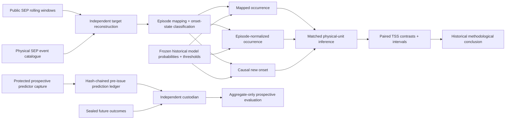

# IRIS-SEP end-to-end architecture — 2026-09-11

## Scientific architecture

The upper path is complete historical methodology evidence. The lower path is implemented as a protected prospective protocol but has **not** produced a prospective scientific result.

## Historical evidence layers

### Layer 1 — model-free SEP-PRISM audit

Purpose: determine whether rolling-window multiplicity and already-active persistence are material benchmark-construction phenomena before asking whether they alter model scores.

Frozen observations:
- 14,464 daily windows;
- 650 stored positives;
- zero target-reconstruction mismatches;
- 614 uniquely mapped positives / 257 episodes;
- EMF = 2.389;
- 418 persistence windows;
- 228 onset windows;
- four onset-state ambiguities;
- 36 separate multi-episode-overlap positives.

### Layer 2 — frozen fixed-model replay

Purpose: keep forecasts fixed and measure only the change caused by changing the evaluation question.

- 7,558 unique score issues;
- six frozen comparators;
- chronological OOF fit/threshold/score roles;
- no post-score threshold reselection;
- matched inference on 85 onset episodes + 1,080 quiet blocks;
- 10,000 shared physical-unit bootstrap draws.

### Layer 3 — independent computational verification

The project uses three distinct evidence paths:

1. replay runner creates persisted prediction/evidence files;
2. dedicated verifier independently reconstructs metrics and bootstrap results from persisted evidence;
3. minimal `recheck_sep_prism_primary_contrasts_v1.py` reconstructs the three primary contrasts without importing benchmark scoring code.

This supports computational reproducibility. It does not make development-exposed historical data scientifically independent.

## Evaluation definitions

### Mapped occurrence

Retains ordinary occurrence semantics on the uniquely mapped sensitivity population. Every mapped positive window has positive weight 1.

### Episode-normalized occurrence

For a physical episode producing `m` mapped positive windows, each window receives weight `1/m`.

Therefore each physical episode has total positive mass:

`sum(1/m for each of its m windows) = 1`.

### New-onset causal

A positive is eligible only when:
- the event is not already active at issue time; and
- a qualifying threshold crossing begins within the future 24-hour horizon.

Already-active persistence remains scientifically reportable but does not count as a new-onset success.

## Inference architecture

Positive resampling unit: distinct mapped onset episode.

Negative resampling unit: Monday-anchored seven-day quiet block.

Pairing rule: the exact same random unit draws are reused across compared estimands/models.

Primary historical contrasts:

1. joint XGBoost: episode-normalized minus mapped occurrence;
2. joint XGBoost: onset minus episode-normalized occurrence;
3. deterministic past-proton proxy: onset minus mapped occurrence.

All three frozen intervals are below zero in the historical replay.

## Prospective architecture

### Development side may access

- public predictor endpoints;
- retrieval timestamps;
- source routing metadata;
- frozen rule/model objects;
- pre-issue probabilities/alerts;
- source/prediction hashes.

### Development side may not access before conclusion freeze

- protected labels;
- protected positive/event counts;
- protected event timestamps;
- protected episode identities;
- protected score summaries used for redesign.

### Predictor path

`prospective_live_input_sources_v1.json`
→ `capture_prospective_input_snapshot_v1.py`
→ frozen raw-input hashes and source receipt
→ `past_proton_active_proxy_rule_v1.json`
→ `build_past_proton_proxy_prediction_v1.py`
→ hash-chained predictor ledger
→ `verify_prospective_prediction_ledger_v1.py`.

### Outcome path

Independent custodian only:

sealed prediction rows + sealed operational target construction
→ `run_custodian_prospective_episode_evaluation_v1.py`
→ aggregate metrics/contrasts/receipt only.

## Scientific stop rules

The project does **not** respond to disappointing evidence by opening a new tuning loop.

- historical replay: frozen after score inspection;
- protected cohort: no development-side inspection for power rescue;
- causal input missing/late: `ABSTAIN`;
- prospective information below 50 onset episodes or 500 quiet blocks: `INSUFFICIENT_CONFIRMATORY_INFORMATION`;
- primary prospective interval not strictly below zero: `NO_PROSPECTIVE_CONFIRMATION`;
- contract violation: execution blocked.

## What the finished project is

This is a **measurement/validation study in solar energetic particle forecasting**. The central product is an auditable evaluation framework that distinguishes three questions frequently mixed by daily rolling-window scores.

It is not primarily:
- a new deep-learning architecture;
- an operational radiation warning service;
- a claim that all prior SEP literature is biased;
- a prospective validation result.
